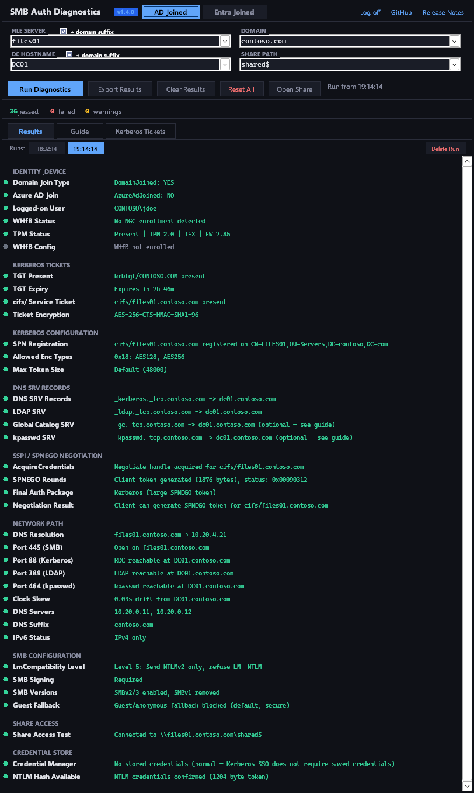
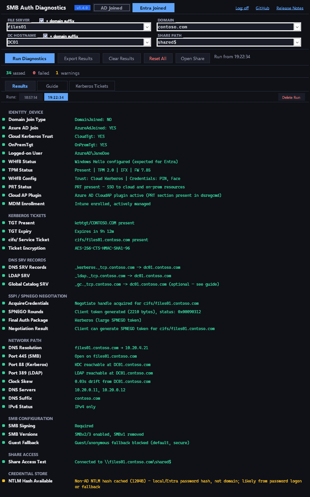
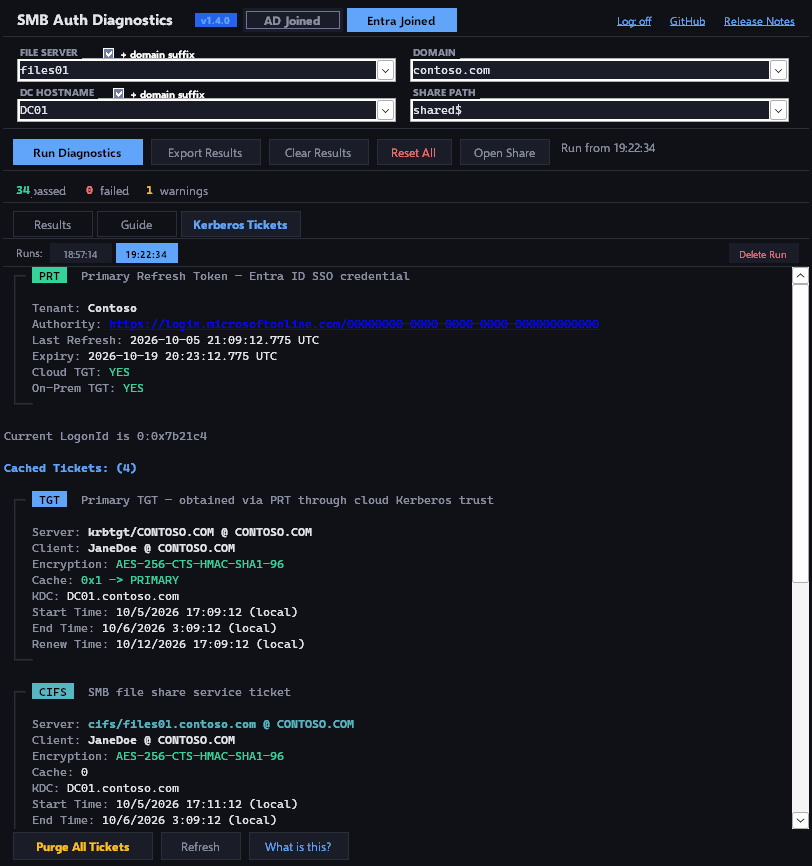

# SMB Auth Diagnostics

Standalone Windows diagnostic tool that tests the full SMB/Kerberos authentication chain. Single-exe, no install required.



## Download

Grab `smb-diag.exe` from the [latest release](https://github.com/darthrater78/smb-diag/releases/latest). No installation — just run. Source: [github.com/darthrater78/smb-diag](https://github.com/darthrater78/smb-diag) · [v1.4.0 release notes](https://github.com/darthrater78/smb-diag/releases/tag/v1.4.0)

## Windows SmartScreen

On first launch, Windows SmartScreen may display a warning ("Windows protected your PC"). This is normal for unsigned executables from the internet. The app is not code-signed — it is a self-contained .NET 8 single-file executable built from the source in this repository. Click **More info** then **Run anyway** to proceed.

## Usage

1. Launch `smb-diag.exe`
2. The app auto-detects your device join type (AD or Entra) on startup via `dsregcmd /status`
3. Enter target details:
   - **File Server** — hostname or FQDN (e.g. `files` or `files.contoso.com`). **+ domain suffix** is on by default, auto-appending the domain to short names. Uncheck to use the value as-is.
   - **Domain** — e.g. `contoso.com`
   - **DC Hostname** — optional, defaults to domain for KDC lookups. **+ domain suffix** is on by default, auto-appending the domain to short names. Uncheck to use the value as-is.
   - **Share Path** — optional share name for access test (e.g. `shared$`)
4. Click **Run Diagnostics** — results stream in as each test group completes
5. Review results or switch to the **Guide** tab for explanations, or **Kerberos Tickets** tab for live ticket cache and PRT status

Input fields remember previously entered values in a dropdown. Up to 5 diagnostic runs are stored per scenario with timestamps — click any run to review it, or **Delete Run** to remove it.

- **Clear** — clears results and run history, keeps input fields and saved settings
- **Reset** — clears everything including input fields and deletes the settings file
- **Export Results** — saves a timestamped text report via Save dialog

### Logging

Logging is **off by default**, and the log is **kept in memory only**: the app never writes it to disk by itself. The **Log** link in the header switches the level, and the level is remembered:

- **Off** — nothing is recorded.
- **On** — each run's targets, every test result, timeouts, cancellations and errors.
- **Debug** — everything in On, plus the command line, exit code, duration and raw output of every tool the app runs, and each DNS lookup and port probe.

**Save log...** in the same menu writes the log to a file you choose; **Clear log** empties it. Closing the app discards whatever was not saved. The log holds at most about 8 million characters (the oldest entries are dropped first) and a single entry is cut at 64K characters. **Reset** turns logging off and discards the log.

## Security

### No credentials are stored or transmitted

This tool is **read-only and diagnostic**. It does not store, transmit, or log any credentials, tokens, or secrets. The optional log (off by default, see [Logging](#logging)) stays in memory unless you save it.

- **SSPI token buffers are zeroed before freeing.** The Negotiate and NTLM token buffers allocated via `Marshal.AllocHGlobal` are explicitly cleared (`Span<byte>.Clear()`) before being freed, preventing auth tokens from lingering in heap memory.
- **No credentials are written to disk.** The settings file (`%LOCALAPPDATA%\smb-diag\settings.json`) contains only input field history (hostnames) and scenario selection — never credentials, tokens, or ticket data.
- **Exported reports contain only metadata.** The text export includes test names and diagnostic details (ticket names, expiry times, encryption types, port status). No raw tokens, password hashes, or credential material is included.
- **External process output is not persisted.** Output from `dsregcmd`, `klist`, `cmdkey`, and other tools is parsed in memory for specific values only. The raw output is never written to disk by the app. With Debug logging on it is also held in the in-memory log, and reaches disk only if you choose **Save log...**.
- **A saved Debug log holds raw tool output.** That means device and tenant IDs, account names, Kerberos ticket listings (names, times and encryption types, never keys) and the names of stored Credential Manager entries (never their passwords). SSPI tokens are never logged. Treat a saved log as you would an exported report before sharing it.
- **`net use` connections are immediately cleaned up.** The Share Access Test creates a temporary connection and deletes it (`net use /delete`) immediately after the test.
- **SSPI contexts are properly released.** `DeleteSecurityContext` and `FreeCredentialsHandle` are called in `finally` blocks to ensure native security handles are not leaked.
- **`cmdkey /list` output is only string-searched.** The Credential Manager test checks for the presence of server/domain entries — the raw credential list is never stored or exported by the app (a Debug log you save yourself includes it).

### Process isolation

- **Single instance enforced.** A global mutex prevents multiple instances from running simultaneously.
- **Background tasks are cancelled on exit.** All async diagnostic work is cancelled via `CancellationToken` on form close, and `Environment.Exit(0)` is called on `FormClosed` as a backstop to ensure the process cannot linger.
- **Input validation on all fields.** Server, domain, and DC fields are validated against `^[a-zA-Z0-9.\-]+$`. Share names are validated against `^[a-zA-Z0-9_\-$.]+$`. No user input is passed to shell commands without validation.
- **No shell execution for diagnostics.** All external processes are launched with `UseShellExecute = false`, `CreateNoWindow = true`, and killed on timeout. The only `UseShellExecute = true` call is the **Open Share** button, which opens a validated UNC path in Explorer.

## Scenarios

| Scenario | Identity Check | Kerberos Source | NTLM Expectation | Credential Manager |
|---|---|---|---|---|
| **AD Joined** | DomainJoined=YES | Direct KDC contact | Hash cached (normal) | Checked (absence is normal) |
| **Entra Joined** | AzureAdJoined=YES, CloudTgt, OnPremTgt, PRT | Cloud Kerberos Trust | Hash absent (expected) | Skipped |



On an Entra-joined device, the **Kerberos Tickets** tab shows the Primary Refresh Token above the ticket cache:



## Test Groups

### 1. Identity & Device

Parses `dsregcmd /status` and checks `WindowsIdentity.GetCurrent()`.

- **Domain Join Type** — DomainJoined status (required for AD, informational for Entra)
- **Azure AD Join** — AzureAdJoined status (required for Entra, informational for AD showing hybrid state)
- **Cloud Kerberos Trust** — CloudTgt must be YES for Entra SSO to on-prem resources (Entra only)
- **OnPremTgt** — confirms CKT is issuing on-prem TGTs via Azure AD (Entra only)
- **Logged-on User** — current Windows identity (DOMAIN\user)
- **WHfB Status** — Windows Hello enrollment; when enabled, NTLM password hash may not be cached
- **TPM Status** — detected via tpmtool, registry, Get-Tpm, and ACPI device enumeration
- **WHfB Config** — trust model (Cloud Kerberos Trust, Certificate Trust, Key Trust), TPM policy, enrolled credentials
- **PRT Status** — Primary Refresh Token required for seamless SSO (Entra only)
- **Cloud AP Plugin** — Azure AD CloudAP authentication plugin presence (Entra only)
- **MDM Enrollment** — Intune/MDM enrollment and management status (Entra only)

### 2. Kerberos Tickets

Parses `klist` output to examine the Kerberos ticket cache.

- **TGT Present** — `krbtgt/REALM` ticket proves KDC contact
- **TGT Expiry** — checks ticket hasn't expired (typically 10h, renewable 7 days)
- **cifs/ Service Ticket** — cached ticket for the file server means auth succeeded
- **Ticket Encryption** — AES-256 preferred; RC4-HMAC indicates legacy configuration

### 3. Kerberos Configuration (AD only)

- **SPN Registration** — verifies `cifs/<server>` registered in AD via `setspn -Q`; falls back to cached service ticket verification if elevation is insufficient
- **Allowed Enc Types** — registry `SupportedEncryptionTypes`: AES required for modern DCs
- **Max Token Size** — users in many groups need >=48000 bytes

### 4. DNS SRV Records

Verifies DNS service discovery records required for Kerberos and Active Directory. Runs for both AD and Entra scenarios — Entra devices with Cloud Kerberos Trust still need these records to locate on-prem services.

- **DNS SRV Records** — `_kerberos._tcp.<domain>` must resolve for automatic KDC discovery
- **LDAP SRV** — `_ldap._tcp.<domain>` must resolve for DC locator (domain joins, group policy, password changes)
- **Global Catalog SRV** (optional) — `_gc._tcp.<domain>` locates Global Catalog servers for cross-domain lookups in multi-domain forests
- **kpasswd SRV** (optional, AD only) — `_kpasswd._tcp.<domain>` advertises the Kerberos password change service; skipped for Entra since password changes go through Entra ID

### 5. SSPI / SPNEGO Negotiation

Uses Windows SSPI API (`secur32.dll`) to test the complete client-side authentication pipeline.

- Acquires Negotiate credentials via `AcquireCredentialsHandle`
- Calls `InitializeSecurityContext` with `ISC_REQ_MUTUAL_AUTH | ISC_REQ_DELEGATE` flags
- **Token > 256 bytes** = Kerberos (SPNEGO-wrapped AP-REQ with service ticket and authenticator)
- **Token <= 256 bytes** = NTLM fallback (Type 1 negotiate message)
- `SEC_I_CONTINUE_NEEDED` (0x00090312) is the expected success status

### 6. Network Path

Tests connectivity to services required for SMB authentication. Port checks run in parallel.

- **DNS Resolution** — resolves file server FQDN to IPv4 addresses
- **Port 445 (SMB)** — direct SMB/CIFS file sharing
- **Port 88 (Kerberos)** — KDC port; unreachable = warning for Entra (uses cloud KDC), failure for AD
- **Port 389 (LDAP)** — directory services
- **Port 464 (kpasswd)** — Kerberos password change service (AD only)
- **Clock Skew** — measured via `w32tm` against DC; Kerberos has strict 5-minute tolerance
- **DNS Servers** — configured DNS servers from `ipconfig /all`
- **DNS Suffix** — warns if domain is not in the DNS suffix search list
- **IPv6 Status** — dual-stack, IPv4-only, or IPv6-only detection

### 7. SMB Configuration

- **LmCompatibility Level** — Level 3+ (NTLMv2 only) recommended; shows "(OS default)" when not explicitly set (AD only)
- **SMB Signing** — Required prevents MITM; Enabled allows but doesn't enforce
- **SMB Versions** — SMBv1 should be disabled; SMBv2/3 required. Detected via registry (mrxsmb10 driver, LanmanServer SMB1/SMB2 values)
- **Guest Fallback** — AllowInsecureGuestAuth should be disabled (secure default)

### 8. Share Access

- **Share Access Test** — `net use` to configured UNC path with automatic cleanup via `net use /delete`

### 9. Credential Store

- **Credential Manager** — queries `cmdkey /list` for saved credentials (AD only). Absence is normal — Kerberos SSO doesn't require saved credentials
- **NTLM Hash Available** — generates an NTLM token via SSPI to definitively test whether the password hash is cached in LSASS. More reliable than registry checks

## Architecture

**Runtime:** .NET 8 WinForms, self-contained single-file executable (win-x64, ReadyToRun AOT, ~63 MB).

**Structure:** Single-file app (`MainForm.cs`). All UI, diagnostics, and SSPI interop in one compilation unit.

**UI:** Owner-drawn `Panel` with `TextRenderer.MeasureText` for word-wrapped results. Static GDI resources prevent handle leaks. Double-buffered rendering eliminates flicker. Dark theme. Test groups stream results in real-time as each completes.

**SSPI Interop:** Direct `secur32.dll` P/Invoke. All native memory (`Marshal.AllocHGlobal`) tracked before try blocks, zeroed, and freed in `finally` blocks.

**Input Validation:**
- `HostnamePattern`: DNS label rules (letters, digits and `-`, 1–63 characters per label, no leading or trailing `-`, no empty labels) — server, domain, DC fields
- `ShareNamePattern`: `^[a-zA-Z0-9_\-$.]+$` — share name field

**Settings:** `%LOCALAPPDATA%\smb-diag\settings.json`. Contains input history and UI state only — no credentials. Persists across exe updates.

### External Process Calls

| Process | Purpose | Timeout |
|---|---|---|
| `dsregcmd /status` | Device join state | 5s |
| `klist` | Kerberos ticket cache | 15s (diag), 5s (Tickets tab) |
| `klist purge` | Clear ticket cache (Tickets tab only) | 5s |
| `setspn -Q` | SPN lookup in AD | 5s |
| `nslookup -type=SRV` | Kerberos DNS discovery | 5s |
| `w32tm /stripchart` | Clock skew measurement | 5s |
| `ipconfig /all` | DNS servers and suffix | 15s |
| `cmdkey /list` | Credential Manager query | 15s |
| `tpmtool getdeviceinformation` | TPM detection | 5s |
| `net use` / `net use /delete` | Share access test | 8s / 3s |

All launched by full System32 path (never searched for by bare name, so a same-named exe next to `smb-diag.exe` cannot run in their place), with `CreateNoWindow`, `UseShellExecute=false`, `RedirectStandardOutput/Error`, async stdout+stderr drain, killed on timeout. Standard input is closed at once, so a tool that prompts gets end-of-file instead of waiting. `secur32.dll` is loaded from System32 only.

**Deadlines and shutdown:** nothing the app waits on is unbounded. DNS lookups give up after 8s, port probes after 3s, the SSPI negotiation after 20s, and reading a tool's output after 3s beyond its exit. Every tool is placed in a Windows job object that is emptied when the app's handle closes, so none outlives the app even if it crashes or is ended from Task Manager. Closing the window cancels the run, stops its tools, saves settings and ends the process at once.

## Build from Source

Requires [.NET 8 SDK](https://dotnet.microsoft.com/download/dotnet/8.0).

```
git clone https://github.com/darthrater78/smb-diag.git
cd smb-diag
dotnet publish -c Release -r win-x64 --self-contained true
```

Output: `bin/Release/net8.0-windows/win-x64/publish/smb-diag.exe`

Unit tests for the process runner and the log (`tests/SmbDiag.Tests`, .NET 10 SDK) run anywhere: `dotnet test tests/SmbDiag.Tests`.

The README screenshots are generated from mock data by `tools/screenshots/run.sh` (Linux, under Wine). See [tools/screenshots/README.md](tools/screenshots/README.md).

## Version History

| Version | Date | Changes |
|---|---|---|
| v1.4.0 | 2026-10-05 | Optional logging (Off / On / Debug), kept in memory and saved only on request; the app now always exits when closed and never leaves tools running: every tool runs in a kill-on-close job, DNS, port probes and SSPI negotiation have deadlines, closing cancels the run; tool errors written to stderr are now shown; unit tests and docs-only CI skip added |
| v1.3.2 | 2026-09-27 | Security hardening from audit: system tools launched by full System32 path (blocks exe planting beside smb-diag.exe), secur32.dll loaded from System32 only, stricter hostname validation (DNS label rules), settings load/save/reset failures reported instead of ignored; CI build, tag-triggered release workflow, workflow linting and Dependabot added |
| v1.3.1 | 2026-07-16 | Fix crash when clicking Clear/Reset mid-run; fix stale "Pending..." history entries on cancelled runs; fix "running..." indicator turning off too early; fix klist Client field not parsing; fix WHfB duplicate entries on registry access failure; fix Open Share ignoring domain suffix; async Kerberos Tickets tab (no more UI freeze); drain stderr in RunProcess to prevent pipe-buffer deadlock; disable action buttons during diagnostic run to prevent data corruption; reentrancy guard on ticket refresh; extract shared suffix helper |
| v1.3.0 | 2026-07-12 | DNS SRV Records split into its own test group, now runs for both AD and Entra scenarios (Entra devices with Cloud Kerberos Trust need _kerberos._tcp and _ldap._tcp for on-prem service access); kpasswd SRV skipped for Entra (password changes go through Entra ID); domain suffix checkboxes now on by default with improved readability |
| v1.2.1 | 2026-07-12 | Added LDAP SRV, Global Catalog SRV, and kpasswd SRV record checks to Kerberos Configuration (AD only); optional checks labeled with guide reference |
| v1.2.0 | 2026-07-10 | Kerberos Tickets tab with klist viewer (ticket type badges, color-coded CIFS servers, Cache Flags, KDC Called), PRT status card from dsregcmd on Entra-joined devices, "What is this?" in-app explainer covering ticket types/Entra/PRT/delegation, domain suffix checkboxes on File Server and DC fields, GitHub and Release Notes links in header, purge moved to Tickets tab (removed from main page), removed Secure Channel test, settings moved to %LOCALAPPDATA%, ReadyToRun AOT for faster startup |
| v1.1.0 | 2026-07-10 | Scenario auto-detection on startup, scenario-aware test skeletons, real-time streaming results, parallel test execution, troubleshooting guide with Fix tips per test, run history (5 per scenario), TPM/WHfB Config/Cloud AP/MDM tests, registry-based SMB version detection, single-instance mutex, SSPI buffer zeroing, process lifecycle cleanup, reduced timeouts |
| v1.0.0 | 2026-07-09 | Initial release — dual-scenario diagnostics, SSPI negotiation testing, persistent input history, guide tabs, export |
